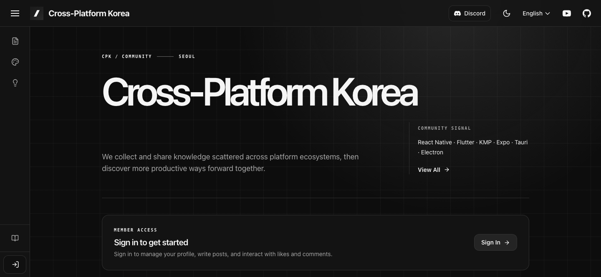

<div align="center">


# Cross-Platform Korea

**여러 플랫폼에 흩어진 지식과 경험을 연결하는 한국 크로스플랫폼 개발자 커뮤니티**

React Native · Flutter · Kotlin Multiplatform · Expo · Tauri · Electron

[](https://github.com/crossplatformkorea/crossplatformkorea.com/actions/workflows/ci.yml)
[](https://github.com/crossplatformkorea/crossplatformkorea.com/actions/workflows/deploy.yml)
[](LICENSE)

[**커뮤니티 →**](https://crossplatformkorea.com) &nbsp;·&nbsp; [**문서와 블로그 →**](https://doc.crossplatformkorea.com) &nbsp;·&nbsp; [**Discord →**](https://discord.gg/XN53mmA9)



</div>

---

## 왜 만드나요

크로스플랫폼 개발의 좋은 정보는 프레임워크마다 다른 곳에 흩어져 있습니다.
React Native에서 풀린 문제가 Flutter에서도 똑같이 반복되고, 한국어로 정리된
경험은 더 찾기 어렵습니다.

Cross-Platform Korea는 그 경험을 한곳에 모아 생태계를 가로질러 나누는 공간입니다.

## 무엇이 있나요

| | |
| --- | --- |
| **커뮤니티 글** | 카테고리별 게시판, 댓글, 멘션, 좋아요, 예약 발행 |
| **쇼케이스** | 커뮤니티가 만든 앱을 스토어 링크와 함께 소개 |
| **문서와 블로그** | Docusaurus 기반 한국어·영어 기술 문서 |
| **기능 요청** | 투표로 우선순위를 정하는 공개 로드맵 |
| **알림** | 웹 푸시 + Slack·Discord 연동 |
| **다국어** | 한국어 · English · 日本語 |

## 기술 스택

| 영역 | 사용 기술 |
| --- | --- |
| 웹 | React 19, Vite 6, TypeScript, Tailwind CSS |
| 백엔드 | Convex (실시간 DB · 함수 · 파일 저장 · 크론) |
| 인증 | Convex Auth — 이메일 OTP, GitHub OAuth |
| 문서 | Docusaurus |
| 배포 | Firebase Hosting (웹) · GitHub Pages (문서) · Convex Cloud |
| 도구 | Bun, ESLint, Prettier, GitHub Actions |

## 빠르게 시작하기

Node.js 20.20.2와 Bun 1.2.21이 필요합니다.

```sh
bun install     # 의존성 설치
bun run setup   # Convex 개발 배포 연결 + 인증 초기화 (최초 1회)
bun run dev     # 웹 + Convex 백엔드 동시 실행
```

`http://localhost:5173`에서 확인할 수 있습니다.

```sh
bun run dev:docs    # 문서 사이트
bun run ci          # 테스트 · 린트 · 타입체크 · 빌드 전체
```

## 프로젝트 구조

```text
apps/
  web/      # React + Vite 커뮤니티 사이트
  docs/     # Docusaurus 문서와 블로그
convex/     # Convex 스키마, 함수, 인증, 크론
tests/      # bun 테스트
```

자세한 개발 환경과 실행 방법은 [CONTRIBUTING.md](CONTRIBUTING.md)를 확인해 주세요.

## 함께하기

기여는 언제나 환영합니다. 이슈와 PR을 열기 전에
[CONTRIBUTING.md](CONTRIBUTING.md)를 먼저 읽어주세요.
보안 문제는 공개 이슈 대신 [SECURITY.md](SECURITY.md)의 절차를 따라주세요.

## License

소프트웨어는 [MIT License](LICENSE)를 따릅니다.

문서와 미디어에는 MIT가 적용되지 않습니다 — `apps/docs`의 `blog/`, `docs/`,
`i18n/`, `static/img/` 저작권은 각 저자와 권리자에게 있습니다. 자세한 내용은
[콘텐츠 권리 안내](apps/docs/CONTENT_RIGHTS.md)를 확인해 주세요.

사이트에 올라온 게시물·댓글·쇼케이스 등 커뮤니티 기여물의 저작권은 작성자
본인에게 있으며, 이 저장소의 라이선스가 적용되지 않습니다.

<div align="center">
<sub>Made by the Cross-Platform Korea community</sub>
</div>
